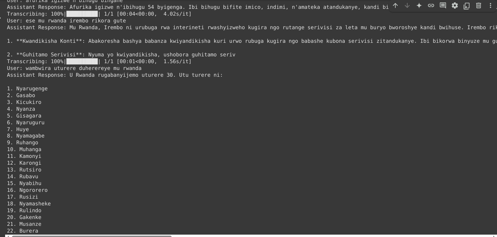
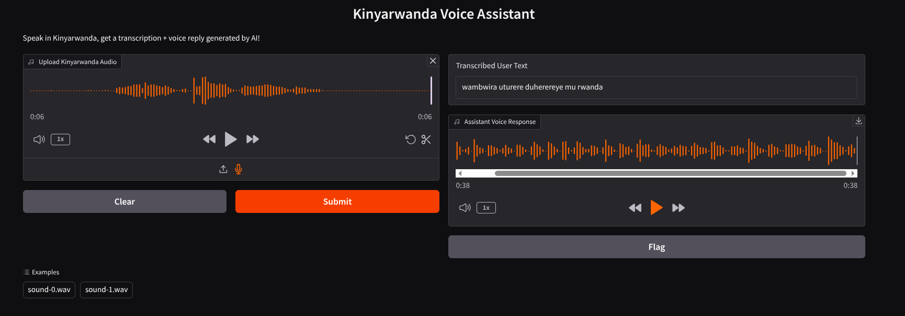
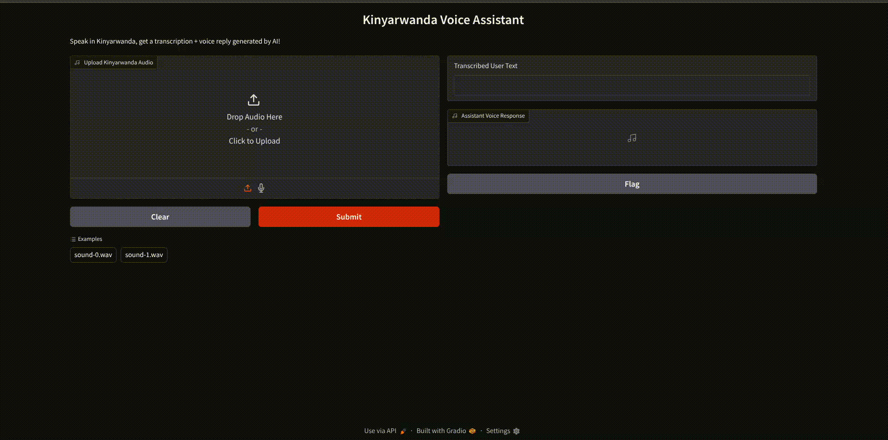

# Kinya Voice Assistant 🎤

A sophisticated voice assistant that understands and responds in Kinyarwanda, providing a natural conversational interface through speech-to-text and text-to-speech capabilities.

## 🌟 Features

- **Voice Input Processing**: Captures and processes Kinyarwanda speech input
- **Speech-to-Text (STT)**: Accurate transcription of Kinyarwanda speech using NeMo-based models
- **Natural Language Processing**: Handles queries using both rule-based patterns and ChatGPT integration
- **Text-to-Speech (TTS)**: High-quality Kinyarwanda speech synthesis using MB-iSTFT-VITS2
- **Interactive Interface**: User-friendly Gradio web interface for easy interaction

## 📝 Description

Kinya Voice Assistant is an innovative project that creates a seamless voice interaction experience in Kinyarwanda. The system follows a three-step process:

1. **Speech Recognition**: Converts spoken Kinyarwanda into text
2. **Query Processing**: Analyzes the text and generates appropriate responses
3. **Speech Synthesis**: Converts the response back into natural-sounding Kinyarwanda speech

## 🖼️ Demo

### Terminal Execution


### User Interface


### Usage Example


## 🛠️ Technical Architecture

### Speech-to-Text (STT)
- Built using NVIDIA NeMo framework
- Utilizes a pretrained Kinyarwanda model from [RW-DEEPSPEECH-API](https://github.com/agent87/RW-DEEPSPEECH-API/tree/main/stt)
- Handles various audio inputs and converts them to text format

### Natural Language Processing
- Implements a hybrid approach:
  - Rule-based pattern matching for common queries
  - ChatGPT integration for handling complex queries
  - Custom intent recognition system
- Supports various conversation types (greetings, questions, general dialogue)

### Text-to-Speech (TTS)
- Based on [KinyaTTS](https://github.com/anzeyimana/KinyaTTS/tree/master/Inference)
- Uses MB-iSTFT-VITS2 model architecture
- Generates natural-sounding Kinyarwanda speech

## 🔧 Setup and Installation

### Prerequisites
- Python 3.x
- NVIDIA GPU (recommended for optimal performance)
- Google Colab (for running the notebook)

### Required Packages
```bash
pip install -e /path/to/Inference/  # KinyaTTS
pip install "numpy<2.1.0,>1.26.0"
pip install Cython
pip install gradio
pip install openai  # For ChatGPT integration
```

## 🚀 Usage

1. Open the notebook in Google Colab
2. Mount your Google Drive containing the model files
3. Run all cells to set up the environment
4. Use the Gradio interface to interact with the assistant

## ⚠️ Known Challenges

1. **Audio Quality Sensitivity**
   - Best performance in quiet environments
   - May have reduced accuracy with background noise

2. **Language Detection**
   - Occasional confusion with similar languages (e.g., Kiswahili)
   - Sample case: "niyume" was detected as Kiswahili

3. **Sampling Rate Issues**
   - Initial challenges with the benax-rw/kinyawishper model
   - Resolved by implementing alternative solutions

## 🗃️ Resources

- Full source code and TTS model: [Google Drive Link](https://drive.google.com/drive/folders/1X6mPLWlz0KGq9IRMAutqmbWb-pZBtSXC?usp=drive_link)
- Project notebook: `kin_assistant.ipynb`

## 👏 Credits

- **Development Platform**: [Google Colab](https://colab.research.google.com/)
- **STT Model**: [RW-DEEPSPEECH-API](https://github.com/agent87/RW-DEEPSPEECH-API/tree/main/stt)
- **TTS Implementation**: [KinyaTTS](https://github.com/anzeyimana/KinyaTTS) by Rwanda MIT researchers
- **Language Model**: OpenAI's ChatGPT for advanced query processing

## 📄 License

This project is open-source and available under the MIT License.

---
Created with ❤️ for Rwanda's technological advancement